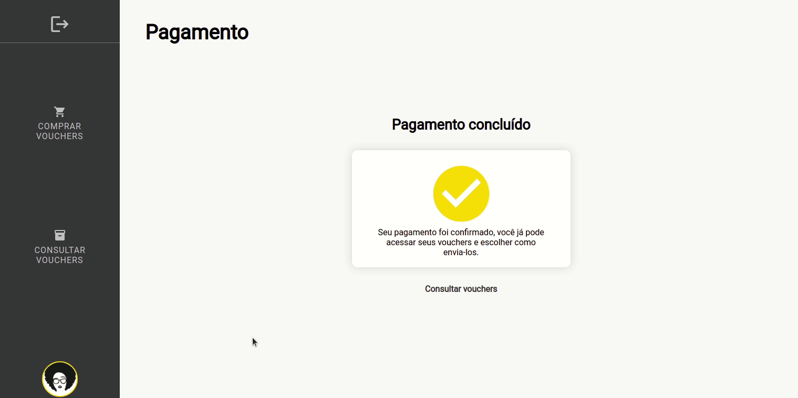
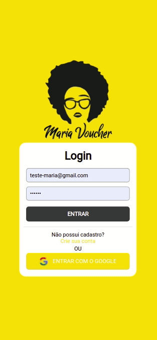
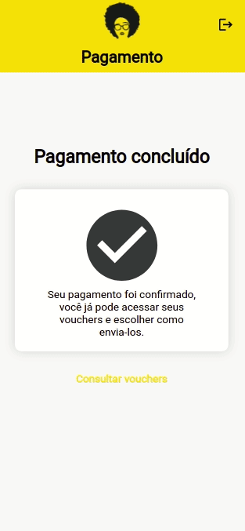
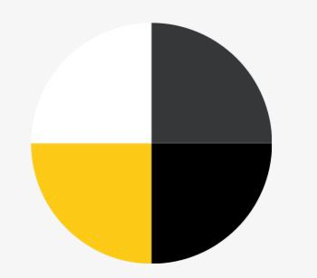
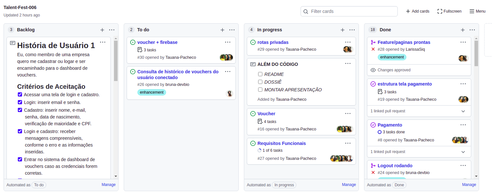

## <Maria Voucher>
 
<h1 align="center">Talent Fest</h1>

<h2 align="center">Squad Zé Delivery </h2>

<h3 align="center"> Hackaton realizado realizado no bootcamp SAP006 da Laboratória</h3><br>

## Definição do Produto

Somos a [Maria Voucher](https://tf-ze-delivery.web.app/)
Com a chegada da pandemia, muitas empresas passaram a trabalhar de forma totalmente remota e,
por questões de segurança, os happy hours passaram a acontecer também remotamente.
Pensando nisso, surgiu a Maria Voucher, uma aplicação Web com foco em empresas que quisessem
confraternizar de forma virtual, aonde o representante da empresa possa se cadastrar, escolher a
quantidade de vouchers e seus valores, efetuar o pagamento, gerar os vouchers e compartilhar com seu time.

 <br>
<div align="center">
  
</div>
 Desktop
<br>
 
<br>
<div align="center">
  
  
</div>
 Mobile
<br>

 
---

## 💡 Protótipos

O processo de criação do prototipo foi pensado buscando um layout intuitivo, minimalista e de fácil compreensão.

Durante o processo, criamos a identidade visual e definimos a paleta de cores inspirada no Ze Delivery.

Usamos o Figma para desenvolver o protótipo de alta fidelidade.

### Paleta de Cores

<div align="center">
  
</div>

---

### Planejamento e Organização

O projeto foi realizado por um squad composto por 6 desenvolvedoras front-end em um prazo de 3 dias. O primeiro desafio encontrado foi fazer um planejamento no qual todas pudessem colaborar com ideias, referências e funcionalidades. Para isso, a organização e o planejamento foram feitos em conjunto através do GitHub projects, usando o método FDP (Fatiar, Dispensar e Priorizar). Essa ferramenta também foi utilizada para compartilhar referências e atribuir as tarefas individuais a serem feitas por cada integrante do squad. Tambem no GitHub trabalhamos com branch's para otimizar o trabalho em equipe.

<div align="center" >
  

</div>

---
## Estrutura dos Principais Arquivos

```
.
├── 📁public
|
├── 📁src
|   |
|   |
|   ├── 📁assets
|   |   ├── img
|   |
|   |
|   ├── 📁components
|   |   ├── 📁Button
|   |   ├── 📁BuyVoucher
|   |   ├── 📁CardMask
|   |   ├── 📁Header
|   |   ├── 📁Input
|   |   ├── 📁InputMask
|   |   ├── 📁Modal
|   |   ├── 📁Navbar
|   |   |-  📁Orders
|   |   |   📁PayVoucher
|   |   |   📁Pix
|   |   |   📁SeeVoucher
|   |   |   📁Sidebar
|   |   |   📁Validation
|   |
|   |
|   ├── 📁pages
|   |   ├── 📁Dashboard
|   |   ├── 📁Login
|   |   ├── 📁PageNotFound
|   |   |── 📁Register
|   |   └── 📁Welcome
|   |
|   |
|
├── 📄README.md
└── 📄package.json
 
```
 
<h2 align="center"> 👩‍💻 Colaboradoras</h2><br>

<table align="center">
  <tr>
      <td align="center">
            <a href="#">
            <br>
            <sub>
            <b>Bruna Calixto</b><br>
            </sub>
            </a>
      </td>
    <td align="center">
      <a href="#">
        <br>
        <sub>
          <b>Sabrina Araújo</b><br>
        </sub>
      </a>
    </td>
    <td align="center">
            <a href="#">
            <br>
            <sub>
            <b>Tauana Pacheco</b><br>
            </sub>
            </a>
      </td>
   
  </tr>
</table>

<table align="center">
      <tr>
      <td>
      <a href="#">
            <br>
            <sub>
            <b>Kamila Moura</b><br>
            </sub>
            </a>    
      </td>
      <td>
            <a href="#">
            <br>
            <sub>
            <b>Larissa Siqueira</b><br>
            </sub>
            </a>
      </td>
      <td>
            <a href="#">
            <br>
            <sub>
            <b>Michele Martins</b><br>
            </sub>
            </a>
      </td>
      </tr>

</table>
